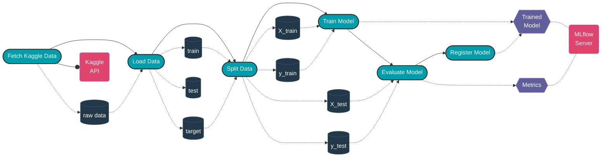

# :ship: Titanic Model

[](https://www.python.org/downloads/release/python-360/)


## :memo: Description

Just having fun with the [Titanic Kaggle competition]!

Using [ZenML] we aim to train a model about the probability of survival for the Titanic passengers and then upload that model on a [Mlflow] instance. If you wish to run your own Mlflow instance on [Heroku] you can check this [repo](https://github.com/jordandelbar/mlflow-heroku).

Here's the workflow of our pipeline:



## :computer: How to run it locally

First thing first, `git clone` this repo on your local machine:
```
git clone git@github.com:jordandelbar/titanic-model.git
```
or with https:
```
git glone https://github.com/jordandelbar/titanic-model.git
```

### :globe_with_meridians: Setting up your python virtual environment

I ran this code using `python 3.10.7`. To install it on your computer and manage several versions of python I recommend using [pyenv].

You can check this [tutorial](https://realpython.com/intro-to-pyenv/) over pyenv. Pyenv is only available for Linux & MacOS so look for [miniconda] if you have a Windows OS (this tutorial assume you are on Linux or MacOS).

Once the installation process is over, simply run:

```bash
pyenv install 3.10.7
```

You can then create a virtual environment running
```bash
pyenv virtualenv 3.10.7 <name-of-your-venv>
```

You can use the pyenv `local` command to set up a `.python-version` file in this directory so that pyenv
automatically activate the virtual environment when entering this folder by running:

```bash
pyenv local <name-of-your-venv>
```

Or you can either use the python built-in virtual environment function and run:
```bash
python -m venv .venv/<name-of-your-venv>
```

That you can activate using:
```bash
source .venv/<name-of-your-venv>/bin/activate
```bash
source .venv/<name-of-your-venv>/bin/activate
```
### :package: Install the different dependencies

Once your virtual environment is set up you can simply run:
```bash
bash scripts/install_dependencies.sh
```
To install the different dependencies needed to run the project.

### :seedling: Environment variables

You will also need several environment variables to run this project:
- a `KAGGLE_USERNAME` and a `KAGGLE_KEY` to download the titanic competition dataset.
- a `ZENML_SERVER_URL`, `ZENML_USERNAME` and `ZENML_PASSWORD` to connect to a running instance of Zenml

You can gather all these environment variables in a `.env` file in the root directory of this repo.

```bash
KAGGLE_USERNAME=<your-kaggle-username>
KAGGLE_KEY=<your-kaggle-key>
ZENML_SERVER_URL=<your-zenml-server-url>
ZENML_USERNAME=<your-zenml-server-username>
ZENML_PASSWORD=<your-zenml-server-password>
PYTHONPATH=.
```

Check-out the `dotenv` pluggin for [oh-my-zsh] to easily load your environment variables.

You can also source them by running:
```bash
export $(grep -v '^#' .env | xargs)
```

For the Kaggle credentials you can also download a `kaggle.json` file from your profile that you can put in your `~/.kaggle` directory.

### :shinto_shrine: Spin up your ZenML server

You can run:
```bash
zenml up --docker
```

to spin up a ZenML server on your local machine and then connect to it by running:

```bash
zenml connect --url=$ZENML_SERVER_URL --username=$ZENML_USERNAME --password=$ZENML_PASSWORD
```

Once connected to your ZenML server you will have to register a new experiment-tracker component and a new [stack](https://docs.zenml.io/starter-guide/stacks).
In order to do so run:

```bash
zenml experiment-tracker register <your-experiment-tracker-component-name> \
 --flavor=mlflow --tracking_uri=<mflow-instance-url> \
 --tracking_username=<mlflow-username> \
 --tracking_password=<mlflow-password>
```
```bash
zenml stack register <your-new-stack-name> -o default -a default -e <your-experiment-tracker-component-name>
```

You can then activate that stack by running:
```bash
zenml stack set <your-new-stack-name>
```

### :alembic: Run the pipeline

Then you can launch the training pipeline by running:
```bash
python titanic_model/run_training_pipeline.py
```

<!-- References -->
[Titanic Kaggle competition]: https://www.kaggle.com/competitions/titanic
[ZenML]: https://docs.zenml.io/getting-started/introduction
[Mlflow]: https://mlflow.org/
[Heroku]: https://www.heroku.com
[pyenv]: https://github.com/pyenv/pyenv
[miniconda]: https://docs.conda.io/en/latest/miniconda.html
[oh-my-zsh]: https://ohmyz.sh/
