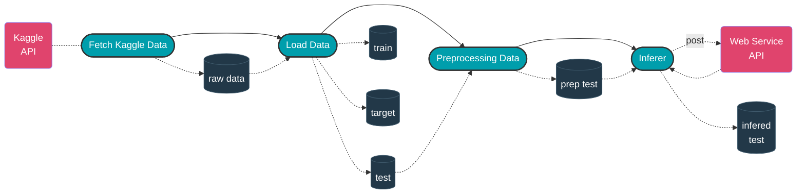

# :ship: Titanic Model

[](https://www.python.org/downloads/release/python-360/)


## :memo: Description

Just having fun with the [Titanic Kaggle competition]!

Using [ZenML] we aim to train a model about the probability of survival for the Titanic passengers and then upload that model on a [Mlflow] instance. If you wish to run your own Mlflow instance on [Heroku] you can check this [repo](https://github.com/jordandelbar/mlflow-heroku).

Once a model is trained and stored in our model registry we can deploy it on a cloud instance (you can check [Bentoctl] for that) or on our local machine. We first use ZenML with [BentoML] in order to create a Docker image.

Then we can run our Docker image as a container and infer the test dataframe from the competition in order to get our probabilities of survival!

### :mechanical_arm: Training pipeline workflow

```mermaid
flowchart LR

%% Flow definitions
fetch_data_kaggle([Fetch Kaggle Data])
loader([Load Data])
preprocessor([Preprocessing Data])
splitter([Split Data])
trainer([Train Model])
evaluator([Evaluate Model])
register([Register Model])

%% Data definitions
raw_data[(raw data)]
train[(train)]
train_preprocessed[(prep train)]
target[(target)]
test[(test)]
X_train[(X_train)]
X_test[(X_test)]
y_train[(y_train)]
y_test[(y_test)]

%% artifacts definitions
trained_model{{Trained<br>Model}}
metrics{{Metrics}}

%% Server definitions
kaggle(Kaggle<br>API)
mlflow(MLflow<br>Server)

%% Flow relationships
fetch_data_kaggle --> loader
loader --> preprocessor
preprocessor --> splitter
splitter --> trainer
trainer --> evaluator
evaluator --> register

%% Data relationships
fetch_data_kaggle .-> raw_data
raw_data .-> loader
loader .-> train
loader .-> target
loader .-> test
train .-> preprocessor
preprocessor .-> train_preprocessed
train_preprocessed .-> splitter
target .-> splitter
splitter .-> X_train
splitter .-> X_test
splitter .-> y_train
splitter .-> y_test
X_train .-> trainer
y_train .-> trainer
X_test .-> evaluator
y_test .-> evaluator

%% Artifacts relationships
trainer .-> trained_model
evaluator .-> metrics
metrics .-> register

%% Server relationship
register --o|rotate models| mlflow
trained_model -.- mlflow
metrics -.- mlflow
kaggle -.- fetch_data_kaggle

%% Color definitions
classDef step fill:#009EAC,stroke:#333,stroke-width:2px,color:#fff;
classDef data fill:#223848,stroke:#3F5A6C,color:#fff;
classDef artifact fill:#615E9C,color:#fff;
classDef server fill:#E0446D,color:#fff;

%% Colors
    %% Steps
    class fetch_data_kaggle step;
    class loader step;
    class preprocessor step;
    class splitter step;
    class trainer step;
    class evaluator step;
    class register step;

    %% Data
    class raw_data data;
    class train data;
    class train_preprocessed data;
    class target data;
    class test data;
    class X_train data;
    class X_test data;
    class y_train data;
    class y_test data;

    %% Artifacts
    class target_definition artifact
    class trained_model artifact
    class metrics artifact

    %% Server
    class mlflow server
    class kaggle server
```


### :rocket: Deploying pipeline workflow

```mermaid
flowchart LR

%% Flow definitions
fetch_model([Fetch Model])
save_model([Save Model])
build_service([Build Service])
containerize_service([Containerize Service])

%% Data definitions


%% artifacts definitions
trained_model{{Trained<br>Model}}
bento_model{{Bento<br>Model}}
bento_service{{Bento<br>Service}}
docker_image{{Docker<br>Service<br>Image}}

%% Server definitions
mlflow(MLflow<br>Server)

%% Flow relationships
fetch_model --> save_model
save_model --> build_service
build_service --> containerize_service


%% Data relationships


%% Artifacts relationships
fetch_model .-> trained_model
trained_model .-> save_model
save_model .-> bento_model
bento_model .-> build_service
build_service .-> bento_service
bento_service .-> containerize_service
containerize_service .-> docker_image

%% Server relationships
mlflow -.- fetch_model

%% Color definitions
classDef step fill:#009EAC,stroke:#333,stroke-width:2px,color:#fff;
classDef data fill:#223848,stroke:#3F5A6C,color:#fff;
classDef artifact fill:#615E9C,color:#fff;
classDef server fill:#E0446D,color:#fff;

%% Colors
    %% Steps
    class fetch_model step;
    class save_model step;
    class build_service step;
    class containerize_service step;

    %% Data


    %% Artifacts
    class trained_model artifact;
    class bento_model artifact;
    class bento_service artifact;
    class docker_image artifact;


    %% Server
    class mlflow server

```


### :robot: Infering pipeline workflow



## :computer: How to run it locally

First thing first, `git clone` this repo on your local machine:
```
git clone git@github.com:jordandelbar/titanic-model.git
```
or with https:
```
git glone https://github.com/jordandelbar/titanic-model.git
```

### :globe_with_meridians: Setting up your python virtual environment

I ran this code using `python 3.10.7`. To install it on your computer and manage several versions of python I recommend using [pyenv].

You can check this [tutorial](https://realpython.com/intro-to-pyenv/) over pyenv. Pyenv is only available for Linux & MacOS so look for [miniconda] if you have a Windows OS (this tutorial assume you are on Linux or MacOS).

Once the installation process is over, simply run:

```bash
pyenv install 3.10.7
```

You can then create a virtual environment running
```bash
pyenv virtualenv 3.10.7 <name-of-your-venv>
```

You can use the pyenv `local` command to set up a `.python-version` file in this directory so that pyenv
automatically activate the virtual environment when entering this folder by running:

```bash
pyenv local <name-of-your-venv>
```

Or you can either use the python built-in virtual environment function and run:
```bash
python -m venv .venv/<name-of-your-venv>
```

That you can activate using:
```bash
source .venv/<name-of-your-venv>/bin/activate
```

### :package: Install the different dependencies

Once your virtual environment is set up you can simply run:
```bash
pip install -r requirements/requirements-dev.txt
```
To install the pre-commit hooks:
```bash
pre-commit install
```
You can also use the bash script that wraps up those two commands:
```bash
bash scripts/install_dependencies.sh
```

### :seedling: Environment variables

You will also need several environment variables to run this project:
- a `KAGGLE_USERNAME` and a `KAGGLE_KEY` to download the titanic competition dataset.
- a `ZENML_SERVER_URL`, `ZENML_USERNAME` and `ZENML_PASSWORD` to connect to a running instance of Zenml
- a `MLFLOW_TRACKING_URI` to your mlflow server and `MLFLOW_TRACKING_USERNAME` and `MLFLOW_TRACKING_PASSWORD` if it is protected
- a `WEB_SERVICE_URL` to infer the test dataframe

You can gather all these environment variables in a `.env` file in the root directory of this repo.

```bash
# Kaggle API secrets
KAGGLE_USERNAME=<your-kaggle-username>
KAGGLE_KEY=<your-kaggle-key>
# ZenML server secrets
ZENML_SERVER_URL=<your-zenml-server-url>
ZENML_USERNAME=<your-zenml-server-username>
ZENML_PASSWORD=<your-zenml-server-password>
# MLflow server secrets
MLFLOW_TRACKING_URI=<your-mlflow-tracking-uri>
MLFLOW_TRACKING_USERNAME=<your-mlflow-username>
MLFLOW_TRACKING_PASSWORD=<your-mlflow-password>
# Web Service URL for inference
WEB_SERVICE_URL=<your-web-service-url>
# Setting up the python path
PYTHONPATH=.
```

Check-out the `dotenv` pluggin for [oh-my-zsh] to easily load your environment variables.

You can also source them by running:
```bash
export $(grep -v '^#' .env | xargs)
```

For the Kaggle credentials you can also download a `kaggle.json` file from your profile that you can put in your `~/.kaggle` directory.

### :shinto_shrine: Spin up your ZenML server

To spin up a ZenML server on your local machine ou can run:
```bash
zenml up --docker
```

And then connect to it by running:
```bash
zenml connect --url=$ZENML_SERVER_URL \
--username=$ZENML_USERNAME \
--password=$ZENML_PASSWORD
```

Once connected to your ZenML server you will have to register a secrets-manager to keep your experiment-tracker secrets in a safe place:
```bash
zenml secrets-manager register <your-secrets-manager-name> --flavor=local \
--username=$MLFLOW_TRACKING_USERNAME \
--password=$MLFLOW_TRACKING_PASSWORD
```

You can then create a new experiment-tracker component:
```bash
zenml experiment-tracker register <your-experiment-tracker-component-name> \
 --flavor=mlflow --tracking_uri=$MLFLOW_TRACKING_URI \
 --tracking_username={{<your-secrets-manager-name>.username}} \
 --tracking_password={{<your-secrets-manager-name>.password}}
```

And a new [stack](https://docs.zenml.io/starter-guide/stacks) (this stack will run on your local machine but you can switch to other orchestrators if you want):
```bash
zenml stack register <your-new-stack-name> \
-o default \
-a default \
-e <your-experiment-tracker-component-name> \
-x <your-secrets-manager-name>
```

You can then activate that stack by running:
```bash
zenml stack set <your-new-stack-name>
```

### :alembic: Run the pipelines

Then you can launch the training pipeline by running:
```bash
python titanic_model/run_training_pipeline.py
```

To run the deployment pipeline and build a docker service image run:
```bash
python titanic_model/run_deploying_pipeline.py
```

### :bellhop_bell: Run your web service API on your local machine and serve

Once you built your docker image from the deploying pipeline you can run it with:

```bash
docker run -it --rm -p 3000:3000 titanic_model_service:<tag-of-your-bento-build>  serve --production
```

Once this is up and running you can infer the test dataframe:

```bash
python titanic_model/run_infering_pipeline.py
```

<!-- References -->
[Titanic Kaggle competition]: https://www.kaggle.com/competitions/titanic
[ZenML]: https://docs.zenml.io/getting-started/introduction
[BentoML]: https://docs.bentoml.org/en/latest/
[Mlflow]: https://mlflow.org/
[Heroku]: https://www.heroku.com
[pyenv]: https://github.com/pyenv/pyenv
[miniconda]: https://docs.conda.io/en/latest/miniconda.html
[oh-my-zsh]: https://ohmyz.sh/
[Bentoctl]: https://github.com/bentoml/bentoctl
